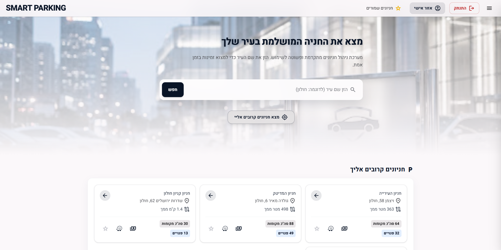
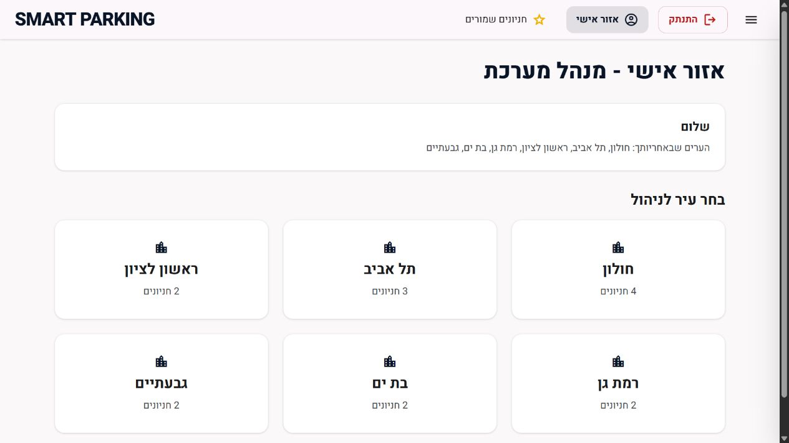
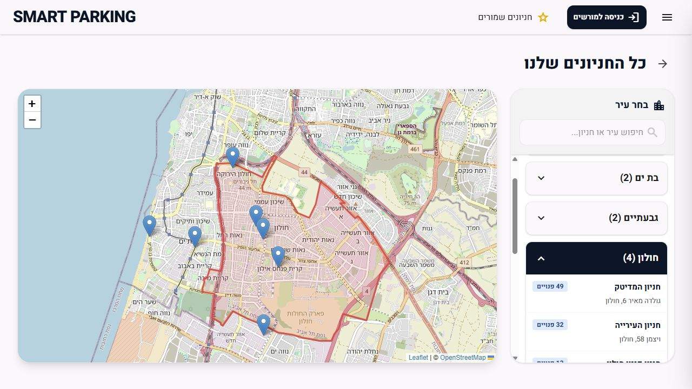
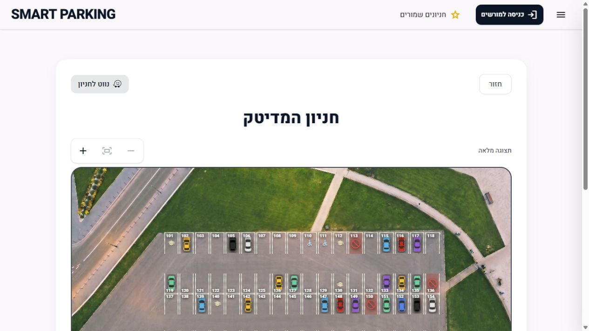
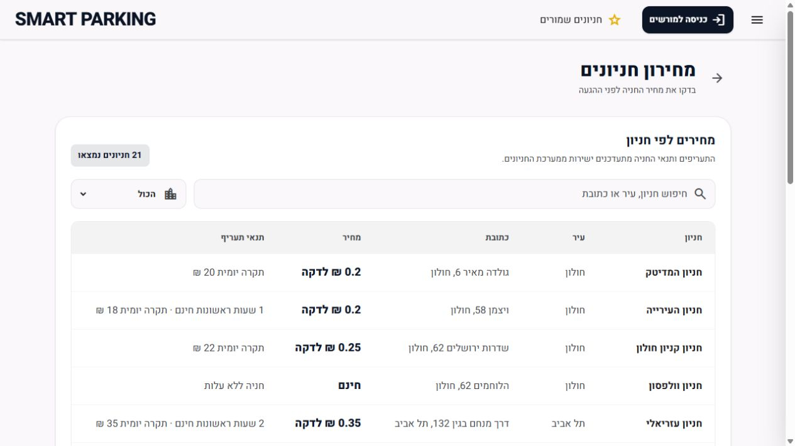
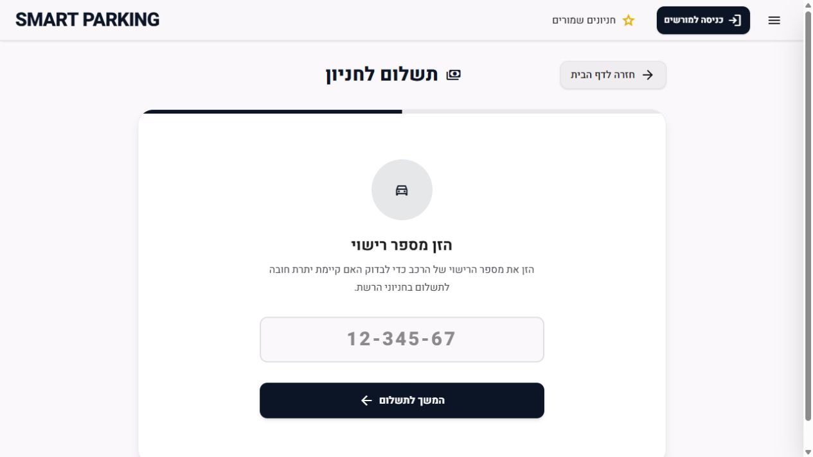
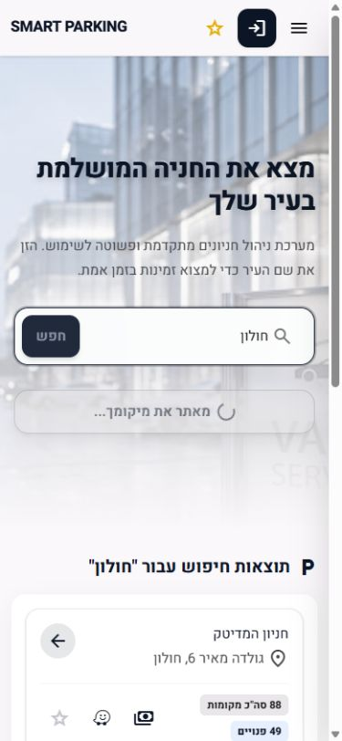
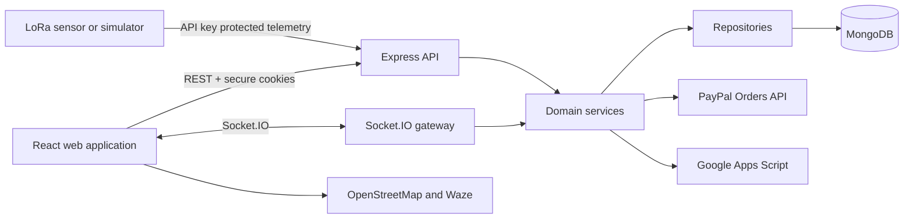

# Smart Parking

Smart Parking is a full-stack parking discovery and management platform built as a final project at HIT - Holon Institute of Technology. Drivers can find parking, inspect live space availability, navigate to a facility, review charges, and pay online. Authorized parking managers can maintain parking lots, levels, spaces, pricing, active sessions, and exempt vehicles.

The interface is a responsive Hebrew RTL web application designed for both mobile and desktop use.

## Live demo

- **Web application:** [smartparking-il.vercel.app](https://smartparking-il.vercel.app/)
- **Backend health check:** [smartparking-il-api.onrender.com/health](https://smartparking-il-api.onrender.com/health)

The public pages can be explored without an account. Manager access and live integrations depend on configured test accounts and service credentials.

## Preview

<table>
  <tr>
    <td></td>
    <td></td>
  </tr>
  <tr>
    <td align="center"><strong>Parking search homepage</strong></td>
    <td align="center"><strong>Manager dashboard</strong></td>
  </tr>
  <tr>
    <td></td>
    <td></td>
  </tr>
  <tr>
    <td align="center"><strong>City-wide parking map</strong></td>
    <td align="center"><strong>Live parking-space layout</strong></td>
  </tr>
  <tr>
    <td></td>
    <td></td>
  </tr>
  <tr>
    <td align="center"><strong>Central tariff list</strong></td>
    <td align="center"><strong>License plate payment lookup</strong></td>
  </tr>
</table>

<details>
  <summary>Mobile preview</summary>
  <p align="center">
    
  </p>
</details>

## Features

### Drivers

- Search for parking by city or browser location.
- Browse all facilities on an interactive Leaflet and OpenStreetMap map.
- Compare distance, address, capacity, live availability, and pricing.
- Open Waze navigation for the selected parking lot.
- Save favorite facilities and recent searches in the browser.
- Inspect levels and individual spaces through image-based maps or a generic layout.
- Zoom, pinch, and pan parking layouts on touch devices, or drag them with a mouse.
- Look up an active parking session by license plate and pay through PayPal.
- Receive a 15-minute exit grace period after payment. New debt accrues if the vehicle remains after the grace period.
- Request an HTML receipt by email after a completed payment.
- Use dark mode, large text, colorblind mode, and alternate color themes.

### Parking managers

- Sign in with cookie-based authentication and access only assigned cities.
- Create, edit, and remove parking lots through protected management workflows.
- Add or remove complete parking levels in a single transactional request.
- Add, edit, block, classify, and remove individual parking spaces.
- Configure free parking, initial free hours, per-minute pricing, and daily limits.
- Monitor active parked vehicles for authorized facilities.
- Maintain per-lot vehicle exemptions and reconcile active parking sessions.
- Receive private real-time parking-session and space updates through Socket.IO.

## Technology stack

| Area | Technology |
| --- | --- |
| Frontend | React 19, Vite 7, JavaScript/JSX, Tailwind CSS 4 |
| Navigation and HTTP | React Router 7, Axios |
| Maps | Leaflet, React Leaflet, OpenStreetMap, Waze links |
| Backend | Node.js ES modules, Express 5 |
| Database | MongoDB Atlas, Mongoose 9 |
| Real-time updates | Socket.IO 4 |
| Payments | PayPal Orders API v2 and PayPal React SDK |
| Receipt delivery | Server-generated HTML sent to Google Apps Script over HTTPS |
| Security | HttpOnly JWT cookies, CSRF tokens, CORS, API keys, bcrypt, persistent rate limits |
| Testing | `node:test` and `node:assert/strict` |

## Architecture



The server remains the source of truth for authorization, parking sessions, pricing, and payment state. Public Socket.IO rooms receive sanitized availability updates, while authenticated manager rooms can receive authorized session details. PayPal webhooks use an idempotency record so repeated provider events do not repeat financial processing.

The backend follows a pragmatic Routes -> Services -> Repositories structure:

- **Routes** define REST endpoints and request-level validation.
- **Services** own authentication, parking, session, LoRa, payment, receipt, and real-time business rules.
- **Repositories** isolate most Mongoose queries.
- **Middleware** enforces JWT authentication, CSRF validation, CORS, API keys, and MongoDB-backed rate limits.

## Main workflows

### Driver journey

1. Search by city or current location.
2. Compare nearby facilities and live availability.
3. Open a parking layout or launch Waze navigation.
4. Enter a license plate on the payment page to load the active session and server-calculated debt.
5. Approve and capture the payment through PayPal.
6. Exit within the 15-minute grace period or begin accruing additional debt afterward.
7. Optionally request an email receipt generated from the completed server-side payment record.

### Manager journey

1. Sign in and load the cities assigned to the account.
2. Select an authorized city and parking lot.
3. Manage structure, spaces, statuses, and pricing.
4. Review active vehicles and maintain the exempt vehicle list.
5. Receive live Socket.IO updates after the server persists each accepted change.

## Local development

### Prerequisites

- Node.js 20 or newer
- npm
- A MongoDB database
- PayPal Sandbox application credentials
- A Google Apps Script deployment if receipt delivery will be tested

### 1. Clone and install

```bash
git clone https://github.com/Drakomt/SmartParking.git
cd SmartParking

cd server
npm install

cd ../client
npm install
```

### 2. Configure the server

Copy `server/.env.example` to `server/.env` and replace the placeholders. The server requires MongoDB, JWT, client-origin, and PayPal settings at startup.

```bash
cd server
npm run dev
```

The API listens on `http://localhost:3000` unless `PORT` is changed.

### 3. Configure the client

Copy `client/.env.example` to `client/.env` and configure the local API URL and PayPal Sandbox client ID.

```bash
cd client
npm run dev
```

Open the URL printed by Vite, normally `http://localhost:5173`.

## Environment configuration

### Client

| Variable | Purpose |
| --- | --- |
| `VITE_API_BASE_URL` | Express server origin, without a trailing API path |
| `VITE_PAYPAL_CLIENT_ID` | Public PayPal Sandbox or production client ID |

The PayPal client secret must remain on the server and must never use a `VITE_` variable.

### Server

| Variable | Purpose |
| --- | --- |
| `MONGO_URI` | MongoDB connection string |
| `JWT_SECRET` | Signs manager authentication tokens |
| `CLIENT_ORIGIN` | Allowed client origins, separated by commas |
| `PAYPAL_ENV` | `sandbox` or `production` |
| `PAYPAL_CLIENT_ID` / `PAYPAL_CLIENT_SECRET` | Server-side PayPal credentials |
| `PAYPAL_WEBHOOK_ID` | PayPal webhook signature verification |
| `GOOGLE_APPS_SCRIPT_URL` / `EMAIL_SERVICE_SECRET` | Receipt email delivery endpoint and shared secret |
| `LORA_API_KEY` | Protects LoRa telemetry routes |
| `DB_SETUP_API_KEY` | Protects destructive database setup routes |

See [`server/.env.example`](server/.env.example) and [`client/.env.example`](client/.env.example) for reference configuration, including optional simulator settings. Do not commit real `.env` files.

## LoRa simulator

The simulator changes parking and session data continuously, so use the local target first:

```bash
cd server
npm run lora-simulator:local
```

The production command is available for an explicitly prepared environment:

```bash
npm run lora-simulator:production
```

Both modes require a matching LoRa API key. Production mode targets the deployed Render service by default and can be redirected with `LORA_PRODUCTION_SERVER_URL`.

## Testing and verification

Run the backend unit and regression tests:

```bash
cd server
npm test
```

Run frontend static verification and a production build:

```bash
cd client
npm run lint
npm run build
```

The automated suite covers pricing edge cases, exit-grace debt recalculation, PayPal capture behavior, webhook deduplication, receipt validation and delivery behavior, authorization boundaries, CSRF and API-key middleware, persistent rate limiting, parking-data integrity, public Socket.IO privacy, and the health endpoint.

Live PayPal Sandbox, Google Apps Script delivery, browser accessibility, responsive rendering, and multi-client Socket.IO behavior still require controlled integration or manual testing. Use the [`manual verification checklist`](docs/manual-testing.md) for those checks.

## API overview

| Prefix | Responsibility |
| --- | --- |
| `/health` | Public lightweight reachability check |
| `/api/auth` | Registration, login, logout, current user, and CSRF tokens |
| `/api/parking` | Discovery, lots, levels, spaces, pricing, sessions, and receipts |
| `/api/paypal` | Order creation, capture, and verified webhooks |
| `/lora` | API-key-protected telemetry and simulation |
| `/api/db` | API-key-protected database initialization and mock seeding |

## Project team

- Matthew Tsiplakov
- Lior Cohen
- Dolev Halabi
- Yashar Pashaiy

HIT - Holon Institute of Technology, Faculty of Science  
Academic advisor: **Netanel Ben Hamo**

## Future improvements

- Validate the system with physical LoRa sensors and longer field trials.
- Add historical occupancy analytics and predictive availability.
- Provide a visual editor for placing spaces on custom parking-lot images.
- Expand monitoring, load testing, and recovery around external integrations.

This repository does not currently include a software license.
